PREDA-Toolchain (PREDA Language Preview Toolchain) is a local toolkit developed for PREDA. It provides the ability for programmers to compile, deploy, and conduct performance tests for their smart contracts.

## Table of Contents

- [Quick start](#quick-start)
  - [Write a smart contract](#write-a-smart-contract)
  - [Compile the smart contract](#compile-the-smart-contract)
  - [Write a test script to test the smart contract](#write-a-test-script-to-test-the-smart-contract)
    - [Write a test script](#write-a-test-script)
    - [Set input parameters of the test script](#set-input-parameters-of-the-test-script)
    - [Run the test script](#run-the-test-script)
    - [Chain info visualization](#chain-info-visualization)
- [PREDA-Toolchain features](#preda-toolchain-features)
  - [Code highlighting](#code-highlighting)
  - [Code auto-completion](#code-auto-completion)
  - [Compile the contract](#compile-the-contract)
  - [Set Compile Args](#set-compile-args)
  - [Run the script](#run-the-script)
  - [Set input parameters of the script](#set-input-parameters-of-the-script)
    - [Built-in parameters](#built-in-parameters)
      - [-order:n](#-ordern)
      - [-sync/-async](#-sync-async)
      - [-perftest](#-perftest)
    - [Custom parameters](#custom-parameters)
  - [Deploy the contract](#deploy-the-contract)
  - [Chain info visualization](#chain-info-visualization-1)
- [PREDA test script syntax](#preda-test-script-syntax)
  - [Allocate address](#allocate-address)
  - [Specify address](#specify-address)
  - [Random](#random)
  - [Set gas limit](#set-gas-limit)
  - [Deploy smart contracts](#deploy-smart-contracts)
  - [Set contract states](#set-contract-states)
  - [Update contract state](#update-contract-state)
  - [Call a contract function](#call-a-contract-function)
  - [Set the permission to issue FCA (First-Class Asset)](#set-the-permission-to-issue-fca-first-class-asset)
  - [Call a contract function with FCA (First-Class Asset)](#call-a-contract-function-with-fca-first-class-asset)
  - [Run the blockchain](#run-the-blockchain)
  - [Get chain info](#get-chain-info)
  - [log](#log)
  - [stopwatch](#stopwatch)
  - [Visualization](#visualization)
    - [viz.block](#vizblock)
    - [viz.shard](#vizshard)
    - [viz.addr](#vizaddr)
    - [viz.txn](#viztxn)
    - [viz.trace](#viztrace)
    - [viz.section](#vizsection)
    - [viz.profiling](#vizprofiling)

## Quick start

Welcome to PREDA-Toolchain. Before learning how to use it, please refer to the Installation Guide document to install PREDA-Toolchain.

After installing the PREDA-Toolchain, it is important to become familiar with it, including how to write a smart contract, compile the smart contract, and write a test script to test the smart contract, by going through the following contents:

- Write a smart contract
- Compile the smart contract 
- Write a test script to test the smart contract

### Write a smart contract

There are some example smart contracts  and test scripts in the installation package for learning and reference.

Next, we will take the *Ballot.prd* as an example to demonstrate.

*Ballot.prd* is a voting smart contract written in PREDA language, it implements voting in parallel on a shard blockchain, of course, we still have a lot of questions for a real practical voting system, but at least we showed how to implement voting logic through PREDA. It has the following functions:

- Initialize proposals
- Vote
- Collect votes

**Initialize proposals**

```cpp
@address function init(array<string> names) export {
    //__debug.assert(controller == __transaction.get_self_address());
    __debug.assert(!is_voting());
    relay@global (^names){
		__debug.print("global: ", names);
        for (uint32 i = 0u; i < names.length(); i++) {
            Proposal proposal;
            proposal.name = names[i];
            proposal.totalVotedWeight = 0u64;
            proposals.push(proposal);
        }
        current_case++;
        last_result.case = 0u;
        last_result.topVoted = "";
    }
	__debug.print("EOC init: ", names);
}
```

> A relay statement is similar to a function call, except that the call is asynchronous. The call data is packaged in a so-called "relay transaction" and relayed to the target address for execution. The relay statement itself returns immediately.

**vote**

```cpp
@address function bool vote(uint32 proposal_index, uint32 case_num) export {
    if(case_num == current_case && case_num > voted_case && proposal_index<proposals.length())
    {
        voted_case = case_num;
		__debug.print("Vote: ", proposal_index);

        /*
        relay@global (^case_num, ^proposal_index, ^weight) {
            if(case_num == current_case)
                proposals[proposal_index].totalVotedWeight += weight;
        }*/
        votedWeights.set_length(proposals.length());
        votedWeights[proposal_index] += weight;
		return true;
    }

	__debug.print("Vote: ", proposal_index, " failed");
	return false;
}
```

**Collect votes**

```cpp
@address function finalize() export {
    //__debug.assert(controller == __transaction.get_self_address());
    __debug.assert(is_voting());
    relay@global (){
        // ... maybe do something else before scatter-gathering
        __debug.print("In global");
        shardGather_reset();
        relay@shards (){
            // ... maybe do something in each shard
			__debug.print("Shard Vote: ", votedWeights);
            relay@global(auto shardVotes = votedWeights) {
                //BEGIN: code for scattering
                for(uint32 i=0u; i<shardVotes.length(); i++)
                {
                    proposals[i].totalVotedWeight += uint64(shardVotes[i]);
                }
                //END

                if(shardGather_gather())
                {
					__debug.print("votes: ", proposals);
                    //BEGIN: code for gathering
                    last_result.case = current_case;
                    uint64 w = 0u64;
                    for(uint32 i=0u; i<proposals.length(); i++)
                    {
                        if(proposals[i].totalVotedWeight > w)
                        {
                            last_result.topVoted = proposals[i].name;
                            w = proposals[i].totalVotedWeight;
                        }
                    }

					__debug.print("result: ", last_result);
                    //END                     
                }
            }
        }
    }
}
```

For more syntax details, please refer to PREDA Language Specification document.


### Compile the smart contract 

Right click on the contract file, select the  `PREDA:Compile`  command to compile the smart contract, this process will check the contract syntax. 

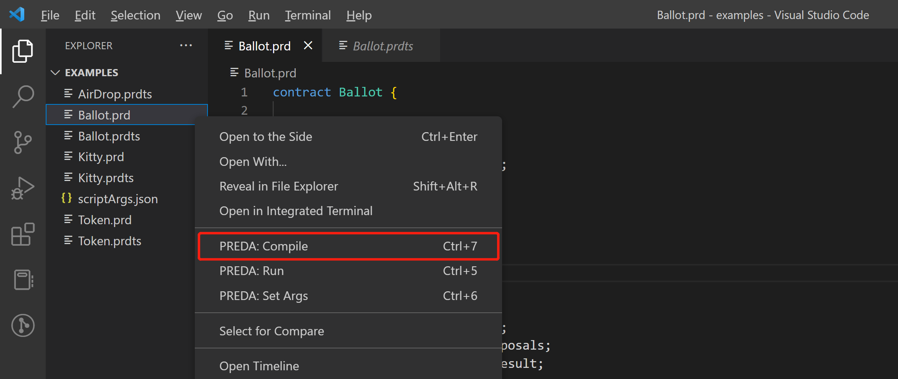

### Write a test script to test the smart contract 

PREDA-toolchain provides a scripting language for testing smart contracts easily, it mainly includes the following functions:

- deploy smart contract
- set on-chain states
- call a smart contract function
- smart contract performance testing
- chain info visualization

Now we will take the *Ballot.prdts* as an example to demonstrate.

#### Write a test script

This is the code details of *Ballot.prdts*

```cpp
// set random seed, default value is timestamp
random.reseed

// allocate some address for the test
allocate.address $~count$

// set gas limit
chain.gaslimit 256

// deploy contract
chain.deploy @1 Ballot.prd

// log
log.highlight Token test
log Perparing test transactions

// set state, prepare for the test
state.set Ballot.address @all { weight:$random(1, 20)$, voted_case:0 } 
 
log.highlight Ballot test: Step 1 

// call Ballot.init at address_0
txn1 = Ballot.init @0 { names: ["Spring", "Yarn", "Combat"] } 

// run the chain
chain.run 
// print chain info
chain.info 
 
log.highlight Ballot test: Step 2 
// call Ballot.vote at all address
txn2[] = Ballot.vote @all { proposal_index: $random(0,2)$, case_num: 1 } 
// print chain info
chain.info 
 
log.highlight Ballot test: Step 3 
// call Ballot.finalize at address_0 to collect votes
txn3 = Ballot.finalize @0 {} 
 
chain.info
log Executing

// start stopwatch
stopwatch.restart
// run the chain to excute transactions
chain.run
// stop stopwatch to report performance
stopwatch.report

chain.info

// address visualization
viz.addr @random
viz.addr @3 Ballot
viz.addr @all

// txn visualization
viz.txn txn1
viz.txn txn2[0]

viz.section Finalize
// trace visualization
viz.trace txn3

// profiling visualization
viz.profiling

```

For more syntax details, please refer to PREDA test script syntax Chapter.

#### Set input parameters of the test script

Right-click on the scipt file, and select  `PREDA：Set Args`

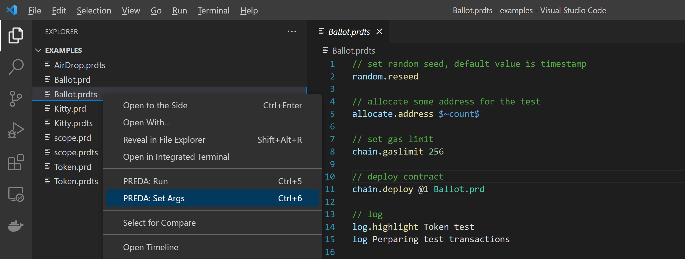

Enter the parameters in the pop-up box and confirm, PREDA-toolchain will execute the script with the set input parameters.

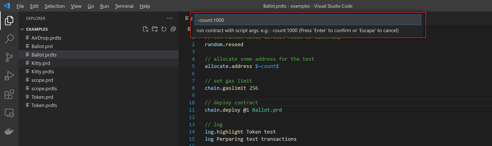

#### Run the test script 

Right click on the script file, and select  `PREDA:Run`, PREDA-toolchain will execute the test script.

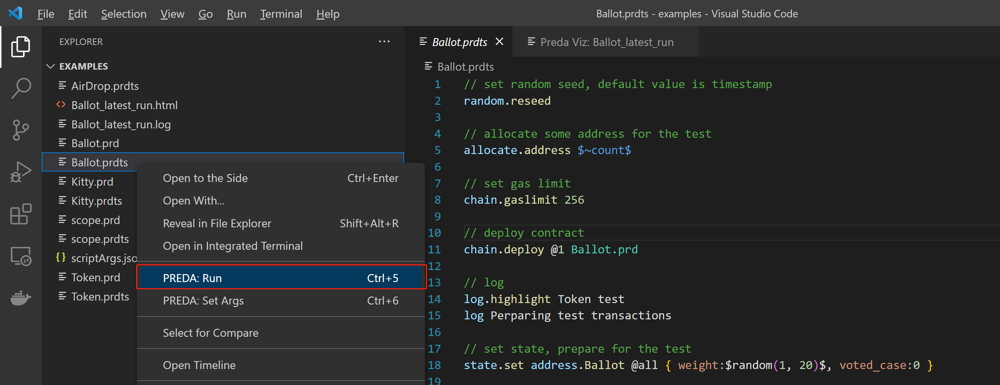

#### Chain info visualization

The PREDA-toolchain will provide a visual interface for chain information after execute the test script.

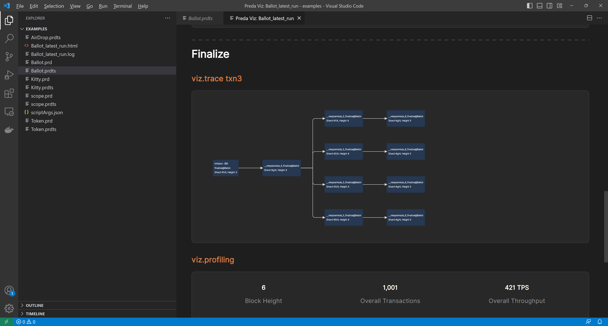

## PREDA-Toolchain features

### Code highlighting

PREDA-Toolchain provide syntax highlighting for *.prd* and *.prdts*.

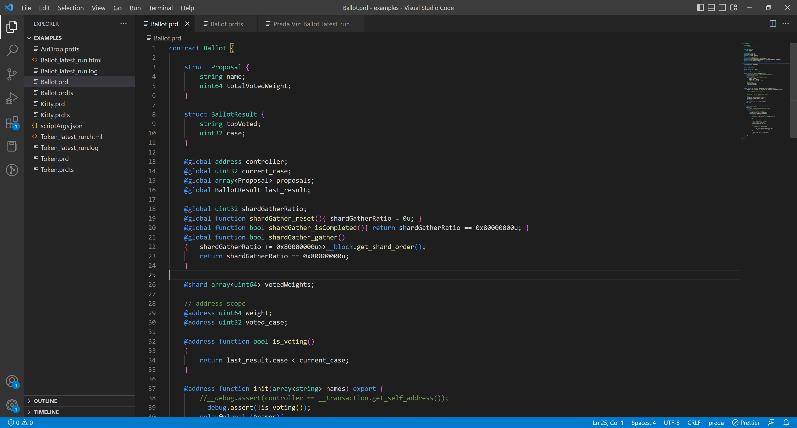

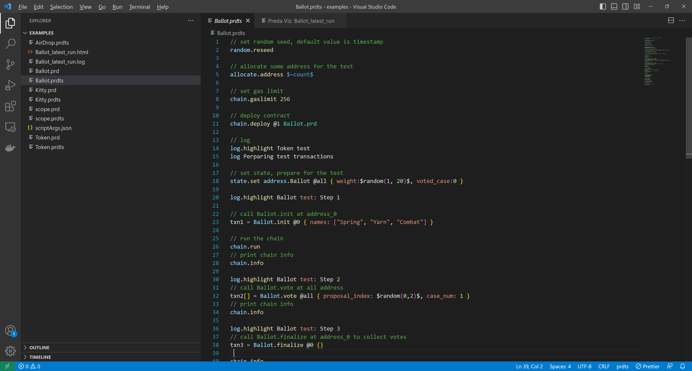

### Code auto-completion

PREDA-Toolchain provide code auto-completion for *.prd* and *.prdts*.

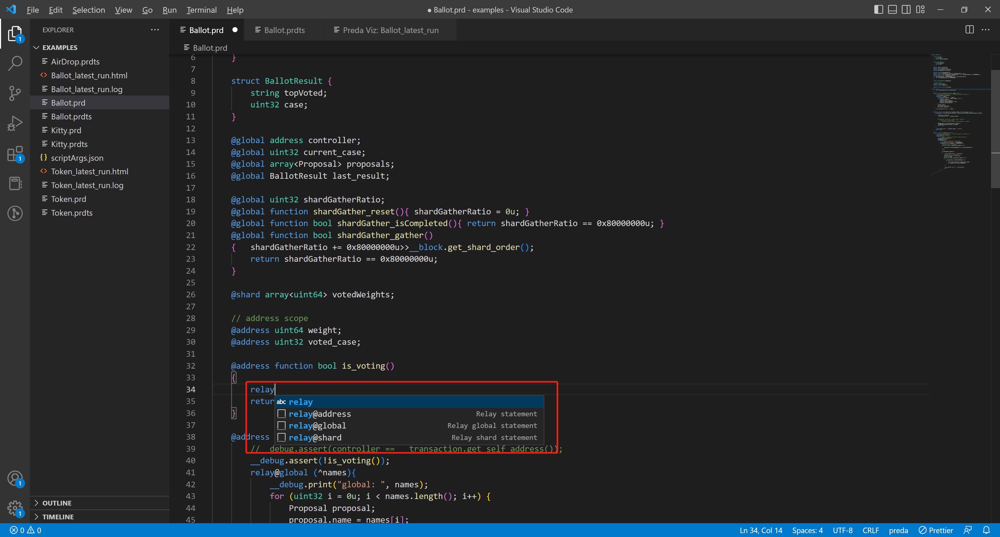

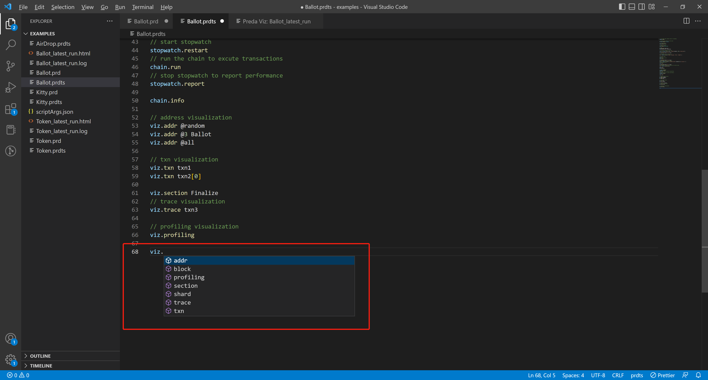

### Compile the contract 

Right-click on the contract file, and select  `PREDA:Compile`, PREDA-Toolchain will check the contract syntax.

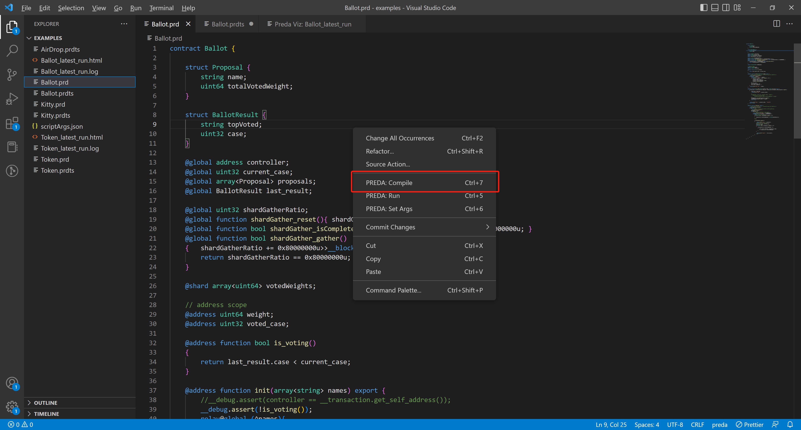

### Set Compile Args

Right-click on the contract file, and select  `PREDA:Set Compile Args`,PREDA-Toolchain will pop up an input box at the top for entering parameters. We can set compile arguments such as contract dependences:

```
./IToken.prd
```

### Run the script 

Right click on the test script file, and select  `PREDA:Run`, PREDA-Toolchain will execute the commands in the test script and output a visual report.

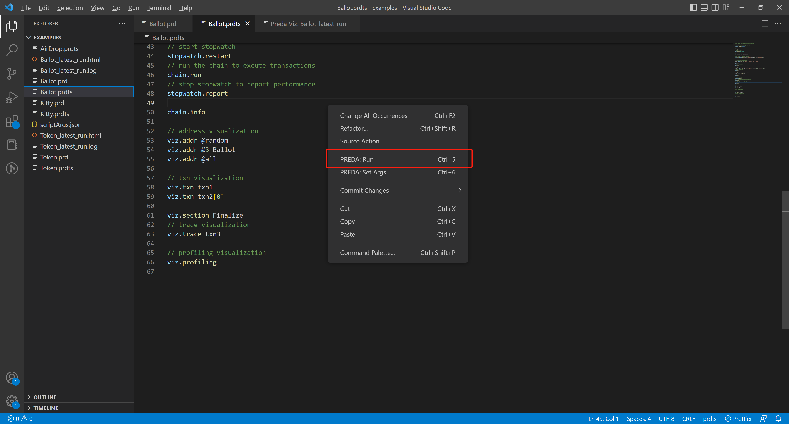

### Set input parameters of the script

Right-click on the script file, and select  `PREDA:Set Args`, PREDA-Toolchain will pop up an input box at the top for entering parameters. The parameter format is as follows:

```
-count:100 -order:1 -sync
```

The script input parameters will be saved in the scriptArgs.json file. 

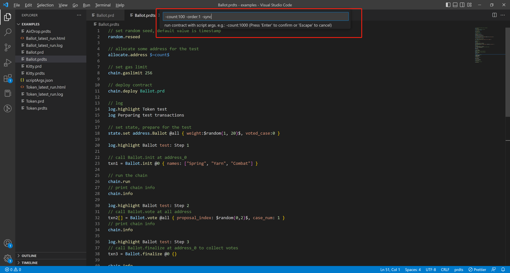

#### Built-in parameters

##### -order:n

The default value of order is 2, is means the blockchain will has  $2^{order}$ shards, the max value of order is 16.

##### -sync/-async

The sharding mode describes the working mode between shards, when the sharding mode is sync, each shard will output blocks synchronously and the block height will be the same; while when the sharding mode is async, each shard will output blocks asynchronously and the block height may be different. 

##### -perftest

By default, PREDA-toolchain will print logs when executing contract calls, which can consume intensive capability during performance testing. Under this circumstance, you can turn on the performance mode by this parameter.

#### Custom parameters

Users can use custom parameters in test scripts, such as:

```
allocate.address $~count$
```

The `$~count$` defines a parameter used to apply for the specified number of addresses, then the user can set the value of this parameter in the pop-up box.

```
-count:100
```

### Deploy the contract

>  **Precondition:** 
>
>      1. Install the DioWallet
>      2. Create your DApp

Right-click on the contract file, and select  `PREDA:Deploy`, PREDA-Toolchain will pop up an input box at the top for entering your dapp name. 

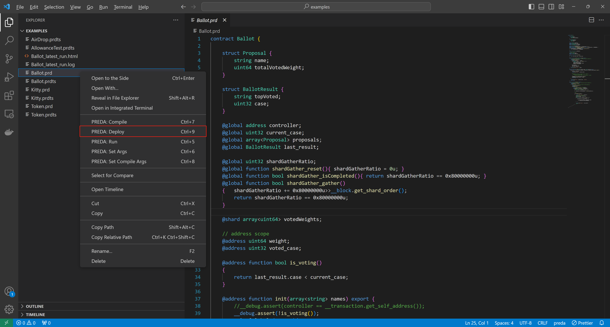

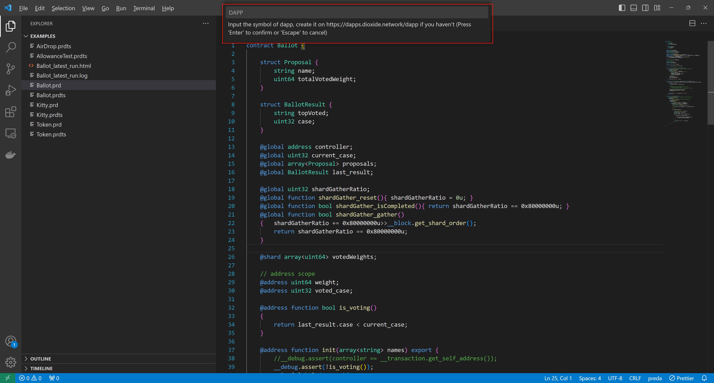

Then enter the contract deployment parameters

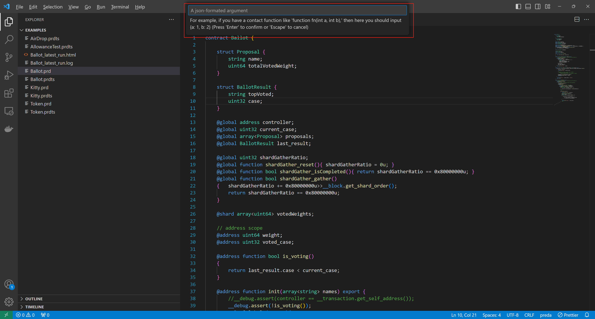

Press `Enter` to confirm

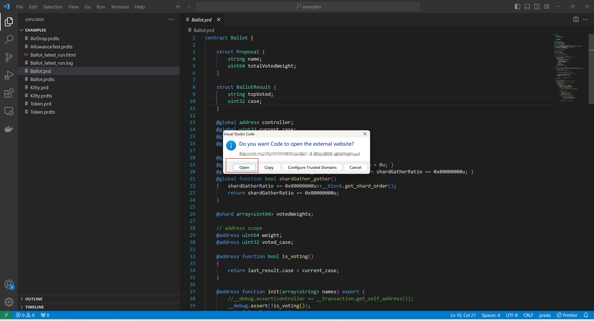

Press  `Open`

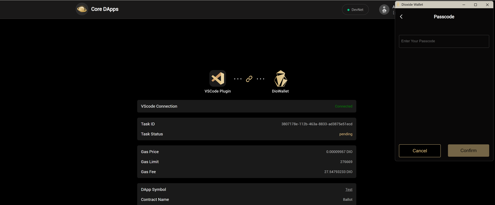

Enter your passcode to confirm transaction.

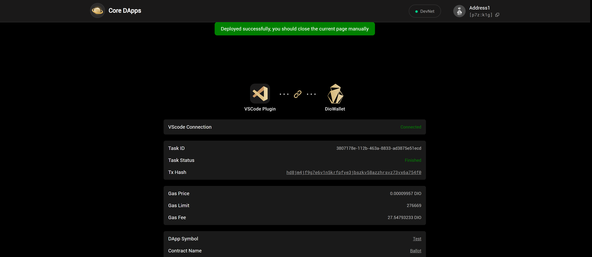

Now, congratulations on the successful deployment of the contract!

### Chain info visualization

PREDA-Toolchain provides a visual interface for displaying information on the chain, after executing the test script, users can specify the information to be displayed through the `viz.` command.

## PREDA test script syntax

### Allocate address

**Description：**

Generate specific number of addresses, The actual number of addresses applied for conforms to the following formula:
$$
\begin{cases} 
actual\_number = shard * n\\ 
shard * (n-1) < specific\_number <= shard * n\\ 
\end{cases}
$$

- **shard:** the number of shards

- **n:** positive integer

**Command：**

```
allocate.address [address_number]
```

**Parameter：**

- **address_number:** the number of addresses to be generated

**Example：**

```cpp
allocate.address 10
```

**Output:**

```cpp
12 addresses added and evenly distributed in shards
```

### Specify address

**Description：**

Use the Allocated address in the test script

**Command：**

```cpp
@address_order
@all
@random
```

**Parameter：**

- **address_order：**address order n, random, all, represents the number n+1th address, random address, and all addresses respectively. 

**Example：**

```cpp
// address_0 initiate a vote
Ballot.init @0 { names: ["Spring", "Yarn", "Combat"] } 
// all address vote
Ballot.vote @all { proposal_index: $random(0,2)$, case_num: 1 } 
// a random address vote
Ballot.vote @random { proposal_index: $random(0,2)$, case_num: 1 } 
```

### Random

**Description:**

The PREDA-Toolchain  provides some functions related to random numbers, for example, specify random address or specify a random input parameter. 

First at all, we should specify a seed for random.

**Command:**

```
random.reseed [seed]
```

**Parameters:**

- **seed:** the default seed is timestamp, but you can set as any value manually

**Example：**

```cpp
// set the random seed
random.reseed 88
// specify a random address when call a contract function
Ballot.init @random { names: ["Spring", "Yarn", "Combat"] } 
// specify a random input parameter between 0 and 2
Ballot.vote @0 { proposal_index: $random(0,2)$, case_num: 1 }
```

### Set gas limit

**Description：**

Set the gas limit which is the maximum amount of gas that transactions in a block can consume.

**Command：**

```
chain.gaslimit [limit]
```

**Parameters：**

- **limit:** the limit for all transaction's gaslimit in a block

**Example：**

```
chain.gaslimit 128
```

### Deploy smart contracts

**Description：**

Deploy smart contracts, multiple contracts can be deployed.

**Command：**

```
chain.deploy @address_order [contract_file] [*contract_file]
```

**Parameters：**

- **contract_file:** the name of the contract file, which supports multiple names to be set at the same time, with space-separated.
- **address_order:** the order of the address that initiated the contract deployment.

**Example：**

```
chain.deploy @0 SimpleStorage.prd
```

**Output：**

```
Compiling 1 contract code(s) ...
contract `SimpleStorage`: 2 function(s) with states in address scope(s)
  0) SimpleStorage.increment: txn
  1) SimpleStorage.decrement: txn
Linking and deploying ...
[PRD]: Successfully deployed 1 contract(s)
```

### Set contract states

**Description：**

Set the state for the blockchain, which is used to initialize the contract state. Users need to set all states in the contract.

**Command：**

- Set global state 

```
state.set contract_name.global { state_name:state_value } 
```

- Set shard state 

```
state.set contract_name.shard @shard_order { state_name:state_value } 
```

- Set address state 

```
state.set contract_name.address @address_order { state_name:state_value } 
```

**Parameters：**

- **contract_name:** the name of the contract 
- **shard_order:** the serial number for shard
- **address_order:** the serial number for address 
- **state_name:** the name of the state to be set 
- **state_value:** the value of the state to be set 

**Example：**

Set global state 

```
state.set Ballot.global { controller:"$@0$", current_case:0, proposals:[], last_result:{topVoted:"",case:0}, shardGatherRatio:0}
```

Set shard state

```
state.set Ballot.shard #all { votedWeights:[] }
```

Set address state 

```
state.set Ballot.address @all { weight:$random(1, 20)$, voted_case:0 } 
```

### Update contract state

**Description：**

Update the state for the blockchain, which is used to initialize the contract state. Users can individually update the specified state in the contract.

**Command：**

- Update global state 

```
state.update contract_name.global { state_name:state_value } 
```

- Update shard state 

```
state.update contract_name.shard @shard_order { state_name:state_value } 
```

- Update address state 

```
state.update contract_name.address @address_order { state_name:state_value } 
```

**Parameters：**

- **contract_name:** the name of the contract 
- **shard_order:** the serial number for shard
- **address_order:** the serial number for address 
- **state_name:** the name of the state to be set 
- **state_value:** the value of the state to be set 

**Example：**

Update global state 

```
state.update Ballot.global { controller:"$@0$", current_case:0, proposals:[], last_result:{topVoted:"",case:0}, shardGatherRatio:0}
```

Update shard state

```
state.update Ballot.shard #all { votedWeights:[] }
```

Update address state 

```
state.update Ballot.address @all { weight:$random(1, 20)$, voted_case:0 } 
```

### Call a contract function

**Description：**

Call a contract function and generate the transaction into mempool .

**Command：**

```cpp
// call a global function
contract_name.contract_function[*call_number] contract_params
// call a shard function 
contract_name.contract_function[*call_number] #shard_order contract_params
// call a address function
contract_name.contract_function[*call_number] @address_order contract_params
```

**Parameters：**

- **contract_name:** the name of the contract
- **contract_function:** the name of the contract function
- **call_number:** the number of call times, which is an optional parameter
- **shard_order:** the serial number for shard, users can also use  `#all`  to specify shard
- **address_order:** the serial number for address, users can also use `@random` and `@all`  to specify address
- **contract_params:** the contract input parameters 

**Example：**

```cpp
// call a global function
KittyBreeding.mint*3 { genes: "$bigint.random(32)$", gender: true, owner: "$@all$" }
// call a shard function 
KittyBreeding.registerNewBorns #all {}
// call a address function
KittyBreeding.breed*$~count$ @random { m: $random(1, ~count-1)$, s: $random(~count+1, ~count*2-1)$, gender : false }
```

### Set the permission to issue FCA (First-Class Asset)

**Description：**

Set the permission to issue FCA, only contracts with FCA issuance authority can mint token in the contract.

**Command：**

```cpp
state.token mint token_name by contract_name
```

**Parameters：**

- **token_name:** the name of the first-class asset
- **contract_name:** the name of the contract which will mint first-class asset

**Example：**

```cpp
state.token mint BTC by FCA
```

### Call a contract function with FCA (First-Class Asset)

**Description：**

Carry the specified FCA with contract function call.

**Command：**

```cpp
contract_name.contract_function @address_order {contract_params} <= (token_amount token_name..)
```

**Parameters：**

- **contract_name:** the name of the contract
- **contract_function:** the name of the contract function
- **address_order:** the serial number for address, users can also use `@random` and `@all`  to specify address
- **token_amount:** the number of tokens carried

- **token_name:** the name of the first-class asset

**Example：**

```cpp
FCA.transfer @0 {to:"$@1$"} <= (100BTC)
```

### Run the blockchain

**Description：**

Run the blockchain to execute transactions in the mempool, then add them to block **until each shard is archived**.

**Command：**

```
chain.run
```

**Example：**

```
chain.run
```

### Get chain info

**Description：**

Output the number of transactions and addresses of current shard in the blockchain. 

**Command：**

```
chain.info
```

**Example：**

```
chain.info
```

**Output：**

```
Global: h:0 txn:0/0/0 addr:0
Shd#0:  h:0 txn:17/0/0 addr:25
Shd#1:  h:0 txn:31/0/0 addr:25
Shd#2:  h:0 txn:23/0/0 addr:25
Shd#3:  h:0 txn:29/0/0 addr:25
Total Txn:100/0
```

### log

**Description：**

Print log or print highlight log

**Command：**

```
log text
log.highlight text
```

**Parameters：**

- **text:** content of the log

**Example:**

```
log this is log
log.highlight this is highlight log
```

**Output：**

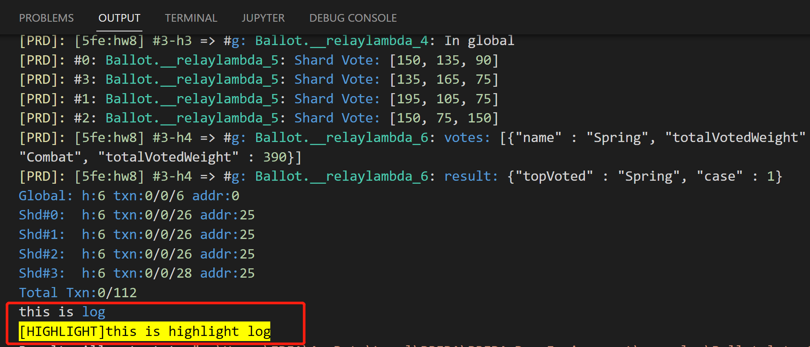

### stopwatch

**Description：**

Test contract performance with stopwatch.

**Command：**

```
stopwatch.restart
stopwatch.report
```

**Example：**

```
stopwatch.restart
chain.run
stopwatch.report
```

**Output：**

```
Stopwatch: 5 msec
Order: 2, TPS:20000, uTPS:20000
```

### Visualization

#### viz.block

**Description：**

Display block information in the visual interface

**Command：**

```cpp
// Display the block information of the specified shard
viz.block #shard_order
// Display the block information of the specified shard and block height
viz.block #shard_order:height
// Display the block information of all shard
viz.block #all
// Display the block information of global shard
viz.block #g
```

**Parameters：**

- **shard_order:** the order of shards
- **height:** the block height

**Example：**

```
viz.block #1:2
```

**Output：**

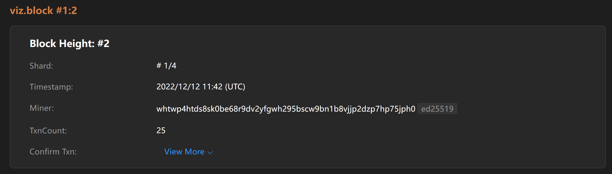

**Example：**

```
log.block #g
```

**Output：**

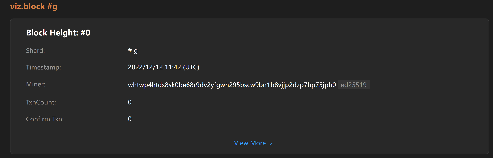

#### viz.shard

**Description：**

Display shard states in the visual interface

**Command：**

```cpp
// Display the shard states of the specified shard
viz.shard #shard_order
// Display the global states
viz.shard #g
// Display all shard states
viz.shard #all
// Display the shard states of the specified shard and contract
viz.shard #shard contract_name
```

**Parameters：**

- **shard_order:** the order of shards
- **contract_name:** the name of contract

**Example：**

```
viz.shard #all
```

**Output：**

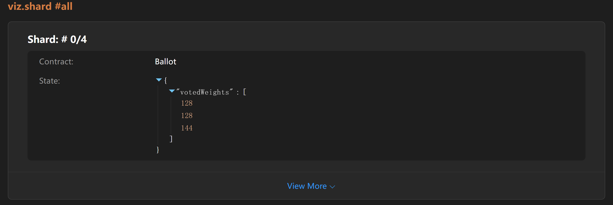

**Example：**

```
viz.shard #g
```

**Output：**

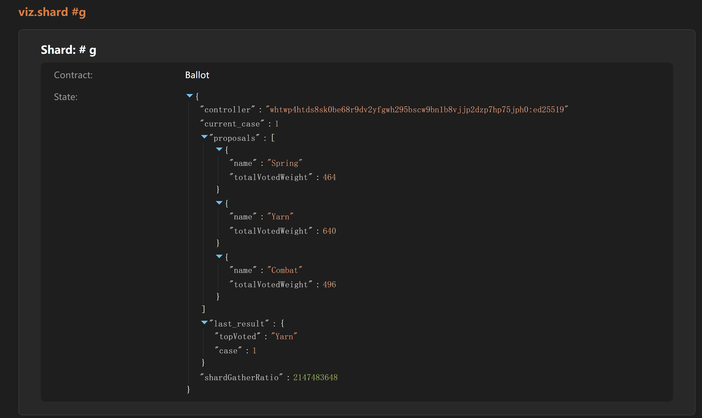

**Example：**

```
viz.shard #1 Ballot
```

**Output：**

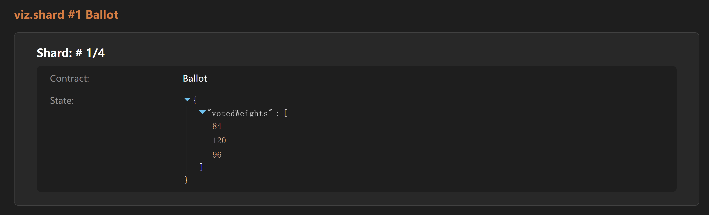

#### viz.addr

**Description：**

Display address states in the visual interface

**Command：**

```cpp
// Display the address states of the specified address
viz.addr @address_order
// Display all address states
viz.shard @all
// Display a random address states
viz.shard @random
// Display the address states of the specified address and contract
viz.shard @address_order contract_name
```

**Parameters：**

- **address_order:** the order of addresses
- **contract_name:** the name of contract

**Example：**

```
viz.addr @random
```

**Output：**

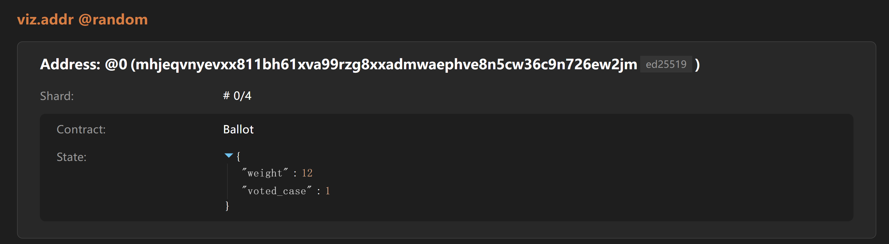

**Example：**

```
viz.addr @3 Ballot
```

**Output：**

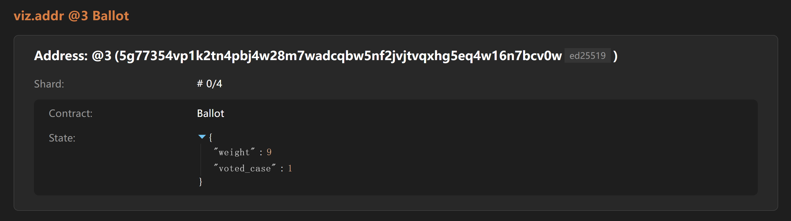

**Example：**

```
viz.addr @all
```

**Output：**

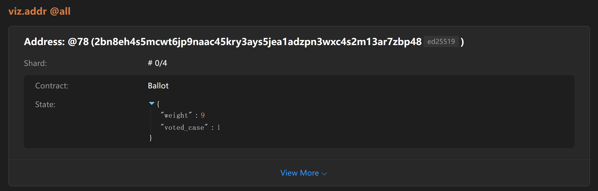

#### viz.txn

**Description：**

Display transaction information in the visual interface

**Command：**

```
viz.txn txn_name
```

**Parameters：**

- **txn_name:** identifies a contract method call, which cannot be repeated

**Example：**

```
txn1 = Ballot.init @0 { names: ["Spring", "Yarn", "Combat"] } 
chain.run
viz.txn txn1
```

**Output：**

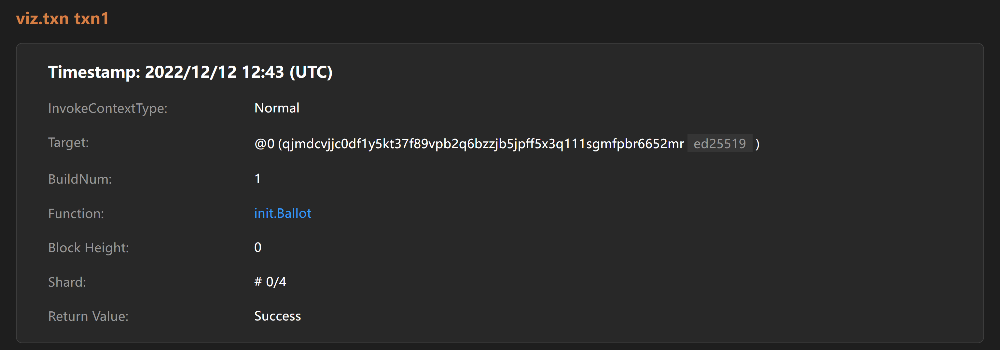

**Example：**

```cpp
txn2[] = Ballot.vote @all { proposal_index: $random(0,2)$, case_num: 1 } 
chain.run
viz.txn txn2[0]
```

**Output：**

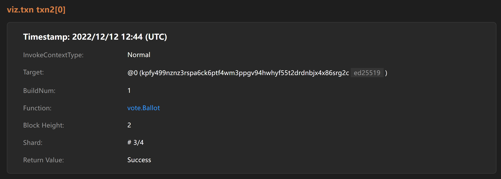

#### viz.trace

**Description：**

Display the transaction call chain in the visual interface

**Command：**

```
viz.trace txn_name
```

**Parameters：**

- **txn_name:** identifies a contract method call, which cannot be repeated

**Example：**

```cpp
txn3 = Ballot.finalize @0 {} 
chain.run
viz.trace txn3
```

**Output：**

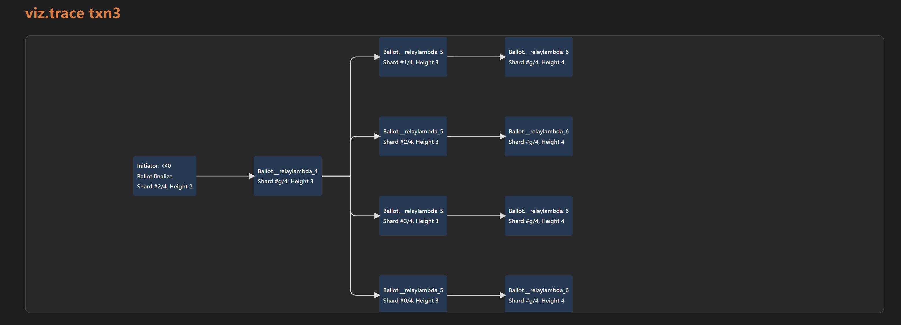

#### viz.section

**Description：**

Display section information in the visual interface

**Command：**

```
viz.section section_name
```

**Parameters：**

- **section_name:** the name of section

**Example：**

```
viz.section Finalize
```

**Output：**

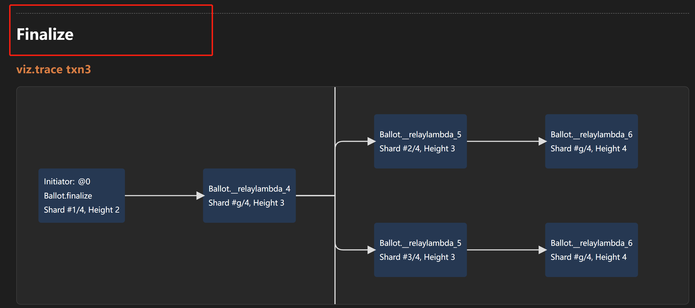

#### viz.profiling

**Description：**

Display performance information in the visual interface, this information relies on the statistics of the stopwatch.

**Command：**

```
viz.profiling
```

**Example：**

```
viz.profiling
```

**Output：**

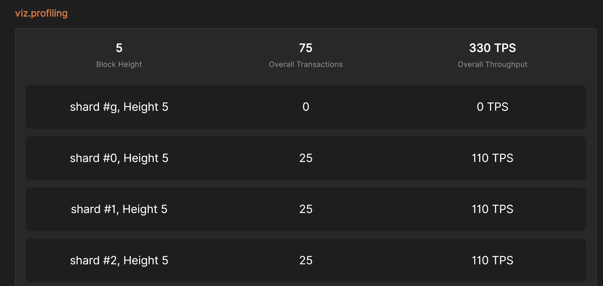