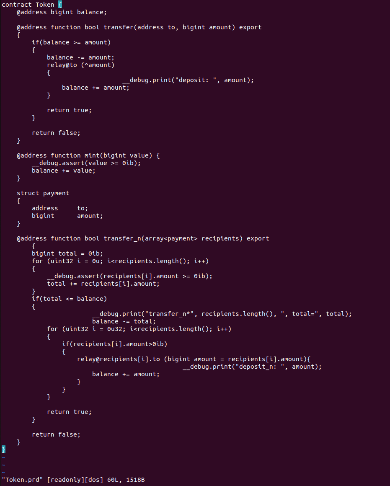
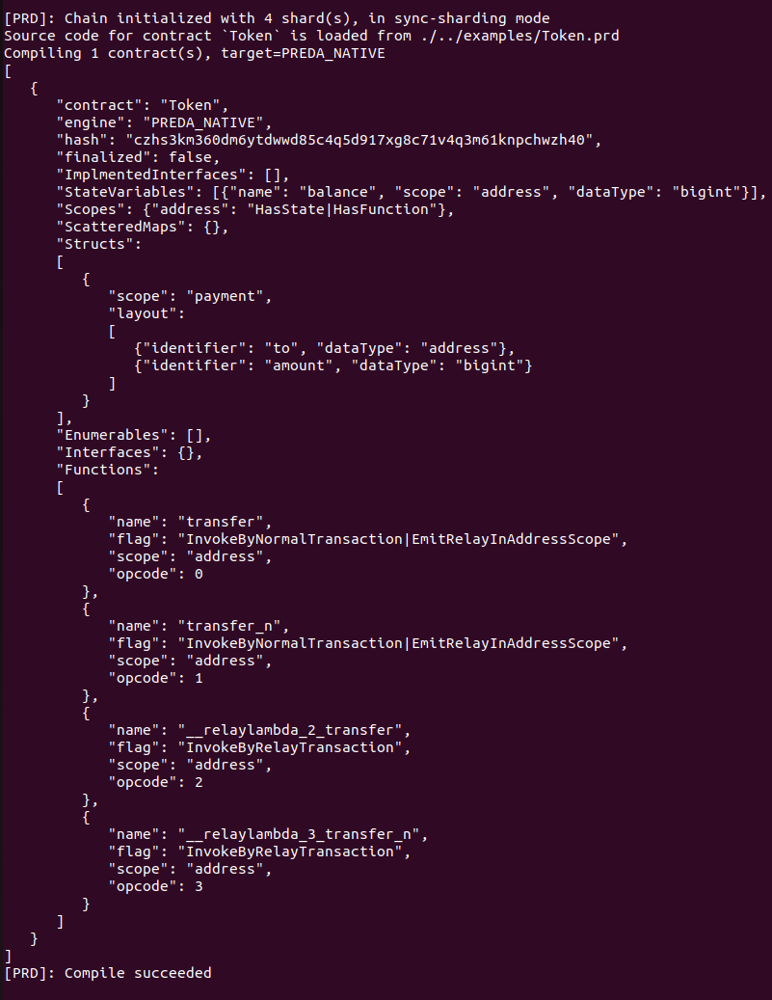
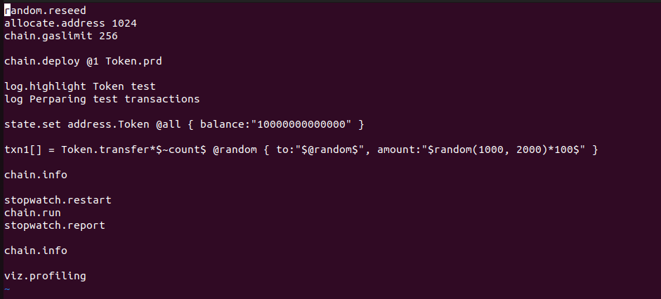
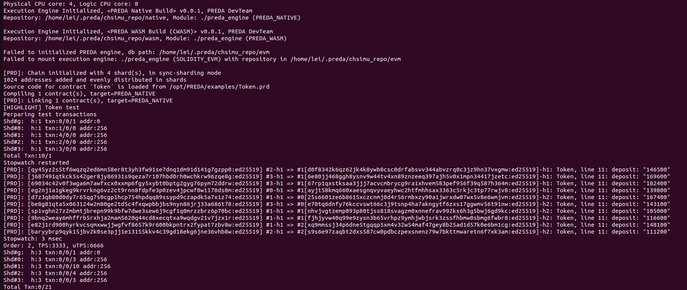

PREDA-Toolchain (PREDA Language Preview Toolchain) is a local toolkit developed for PREDA. It provides the ability for programmers to compile, deploy, and conduct performance tests for their smart contracts.

## Quick start

Welcome to PREDA-Toolchain. Before learning how to use it, please refer to the Installation Guide document to install PREDA-Toolchain.

After installing the PREDA-Toolchain, it is important to become familiar with it, we have provided some sample contracts and scripts in the examples directory of the installation directory.

### Check out the sample contract

```shell
cd /opt/PREDA/examples
view Token.prd
```



The Token.prd is a simple token example written in the PREDA language, it provides mint, transfer and transfer_n functions.


### Compile the smart contract 

In the bin directory there is our executable program, we can compile the contract through it.

```
cd /opt/PREDA/bin
./chsimu ./../examples/Token.prd -stdout
```



### Check out the test script

```
cd /opt/PREDA/examples
view Token.prdts
```



PREDA-toolchain provides a scripting language for testing smart contracts easily, it mainly includes the following functions:

- deploy smart contract
- set on-chain states
- call a smart contract function
- smart contract performance testing
- chain info visualization(need the VsCode)

For more syntax details, please refer to PREDA test script syntax Chapter.

### Run the test script 

```
cd /opt/PREDA/bin
./chsimu ./../examples/Token.prdts -count:10 -stdout
```



`-count:10` is the test script input parameter, we have two types of input parameters.

#### Built-in parameters

##### -order:n

The default value of order is 2, is means the blockchain will has  $2^{order}$ shards, the max value of order is 16.

##### -sync/-async

The sharding mode describes the working mode between shards, when the sharding mode is sync, each shard will output blocks synchronously and the block height will be the same; while when the sharding mode is async, each shard will output blocks asynchronously and the block height may be different. 

##### -perftest

By default, PREDA-toolchain will print logs when executing contract calls, which can consume intensive capability during performance testing. Under this circumstance, you can turn on the performance mode by this parameter.

#### Custom parameters

Users can use custom parameters in test scripts, such as:

```
Token.transfer*$~count$
```

The `$~count$` defines a parameter used to apply for the specified number of transfer transaction, then the user can set the value of this parameter after command

```
./chsimu ./../examples/Token.prdts -count:10 -stdout
```

## PREDA test script syntax

### Allocate address

**Description：**

Generate specific number of addresses, The actual number of addresses applied for conforms to the following formula:
$$
\begin{cases} 
actual\_number = shard * n\\ 
shard * (n-1)<= specific\_number <= shard * n\\ 
\end{cases}
$$

- **shard:** the number of shards

- **n:** positive integer

**Command：**

```
allocate.address [address_number]
```

**Parameter：**

- **address_number:** the number of addresses to be generated

**Example：**

```cpp
allocate.address 10
```

**Output:**

```cpp
12 addresses added and evenly distributed in shards
```

### Specify address

**Description：**

Use the Allocated address in the test script

**Command：**

```cpp
@address_order
@all
@random
```

**Parameter：**

- **address_order：**address order n, random, all, represents the number n+1th address, random address, and all addresses respectively. 

**Example：**

```cpp
// address_0 initiate a vote
Ballot.init @0 { names: ["Spring", "Yarn", "Combat"] } 
// all address vote
Ballot.vote @all { proposal_index: $random(0,2)$, case_num: 1 } 
// a random address vote
Ballot.vote @random { proposal_index: $random(0,2)$, case_num: 1 } 
```

### Random

**Description:**

The PREDA-Toolchain  provides some functions related to random numbers, for example, specify random address or specify a random input parameter. 

First at all, we should specify a seed for random.

**Command:**

```
random.reseed [seed]
```

**Parameters:**

- **seed:** the default seed is timestamp, but you can set as any value manually

**Example：**

```cpp
// set the random seed
random.reseed 88
// specify a random address when call a contract function
Ballot.init @random { names: ["Spring", "Yarn", "Combat"] } 
// specify a random input parameter between 0 and 2
Ballot.vote @0 { proposal_index: $random(0,2)$, case_num: 1 }
```

### Set gas limit

**Description：**

Set the gas limit which is the maximum amount of gas that transactions in a block can consume.

**Command：**

```
chain.gaslimit [limit]
```

**Parameters：**

- **limit:** the limit for all transaction's gaslimit in a block

**Example：**

```
chain.gaslimit 128
```

### Deploy smart contracts

**Description：**

Deploy smart contracts, multiple contracts can be deployed.

**Command：**

```
chain.deploy @address_order [contract_file] [*contract_file]
```

**Parameters：**

- **contract_file:** the name of the contract file, which supports multiple names to be set at the same time, with space-separated.
- **address_order:** the order of the address that initiated the contract deployment.

**Example：**

```
chain.deploy @0 SimpleStorage.prd
```

**Output：**

```
Compiling 1 contract code(s) ...
contract `SimpleStorage`: 2 function(s) with states in address scope(s)
  0) SimpleStorage.increment: txn
  1) SimpleStorage.decrement: txn
Linking and deploying ...
[PRD]: Successfully deployed 1 contract(s)
```

### Set contract states

**Description：**

Set the state for the blockchain, which is used to initialize the contract state. Users need to set all states in the contract.

**Command：**

- Set global state 

```
state.set contract_name.global { state_name:state_value } 
```

- Set shard state 

```
state.set contract_name.shard @shard_order { state_name:state_value } 
```

- Set address state 

```
state.set contract_name.address @address_order { state_name:state_value } 
```

**Parameters：**

- **contract_name:** the name of the contract 
- **shard_order:** the serial number for shard
- **address_order:** the serial number for address 
- **state_name:** the name of the state to be set 
- **state_value:** the value of the state to be set 

**Example：**

Set global state 

```
state.set Ballot.global { controller:"$@0$", current_case:0, proposals:[], last_result:{topVoted:"",case:0}, shardGatherRatio:0}
```

Set shard state

```
state.set Ballot.shard #all { votedWeights:[] }
```

Set address state 

```
state.set Ballot.address @all { weight:$random(1, 20)$, voted_case:0 } 
```

### Update contract state

**Description：**

Update the state for the blockchain, which is used to initialize the contract state. Users can individually update the specified state in the contract.

**Command：**

- Update global state 

```
state.update contract_name.global { state_name:state_value } 
```

- Update shard state 

```
state.update contract_name.shard @shard_order { state_name:state_value } 
```

- Update address state 

```
state.update contract_name.address @address_order { state_name:state_value } 
```

**Parameters：**

- **contract_name:** the name of the contract 
- **shard_order:** the serial number for shard
- **address_order:** the serial number for address 
- **state_name:** the name of the state to be set 
- **state_value:** the value of the state to be set 

**Example：**

Update global state 

```
state.update Ballot.global { controller:"$@0$", current_case:0, proposals:[], last_result:{topVoted:"",case:0}, shardGatherRatio:0}
```

Update shard state

```
state.update Ballot.shard #all { votedWeights:[] }
```

Update address state 

```
state.update Ballot.address @all { weight:$random(1, 20)$, voted_case:0 } 
```

### Call a contract function

**Description：**

Call a contract function and generate the transaction into mempool .

**Command：**

```cpp
// call a global function
contract_name.contract_function[*call_number] contract_params
// call a shard function 
contract_name.contract_function[*call_number] #shard_order contract_params
// call a address function
contract_name.contract_function[*call_number] @address_order contract_params
```

**Parameters：**

- **contract_name:** the name of the contract
- **contract_function:** the name of the contract function
- **call_number:** the number of call times, which is an optional parameter
- **shard_order:** the serial number for shard, users can also use  `#all`  to specify shard
- **address_order:** the serial number for address, users can also use `@random` and `@all`  to specify address
- **contract_params:** contract input parameters 

**Example：**

```cpp
// call a global function
KittyBreeding.mint*3 { genes: "$bigint.random(32)$", gender: true, owner: "$@all$" }
// call a shard function 
KittyBreeding.registerNewBorns #all {}
// call a address function
KittyBreeding.breed*$~count$ @random { m: $random(1, ~count-1)$, s: $random(~count+1, ~count*2-1)$, gender : false }
```

### Set the permission to issue FCA (First-Class Asset)

**Description：**

Set the permission to issue FCA, only contracts with FCA issuance authority can mint token in the contract.

**Command：**

```cpp
state.token mint token_name by contract_name
```

**Parameters：**

- **token_name:** the name of the first-class asset
- **contract_name:** the name of the contract which will mint first-class asset

**Example：**

```cpp
state.token mint BTC by FCA
```

### Call a contract function with FCA (First-Class Asset)

**Description：**

Carry the specified FCA with contract function call.

**Command：**

```cpp
contract_name.contract_function @address_order {contract_params} <= (token_amount token_name..)
```

**Parameters：**

- **contract_name:** the name of the contract
- **contract_function:** the name of the contract function
- **address_order:** the serial number for address, users can also use `@random` and `@all`  to specify address
- **token_amount:** the number of tokens carried

- **token_name:** the name of the first-class asset

**Example：**

```cpp
FCA.transfer @0 {to:"$@1$"} <= (100BTC)
```

### Run the blockchain

**Description：**

Run the blockchain to execute transanctions in the mempool, then add them to block **until each shard is archived**.

**Command：**

```
chain.run
```

**Example：**

```
chain.run
```

### Get chain info

**Description：**

Output the number of transactions and addresses of current shard in the blockchain. 

**Command：**

```
chain.info
```

**Example：**

```
chain.info
```

**Output：**

```
Global: h:0 txn:0/0/0 addr:0
Shd#0:  h:0 txn:17/0/0 addr:25
Shd#1:  h:0 txn:31/0/0 addr:25
Shd#2:  h:0 txn:23/0/0 addr:25
Shd#3:  h:0 txn:29/0/0 addr:25
Total Txn:100/0
```

### log

**Description：**

Print log

**Command：**

```
log text
```

**Parameters：**

- **text:** content of the log

**Example:**

```
log this is log
```

### stopwatch

**Description：**

Test contract performance with stopwatch.

**Command：**

```
stopwatch.restart
stopwatch.report
```

**Example：**

```
stopwatch.restart
chain.run
stopwatch.report
```

**Output：**

```
Stopwatch: 5 msec
Order: 2, TPS:20000, uTPS:20000
```

